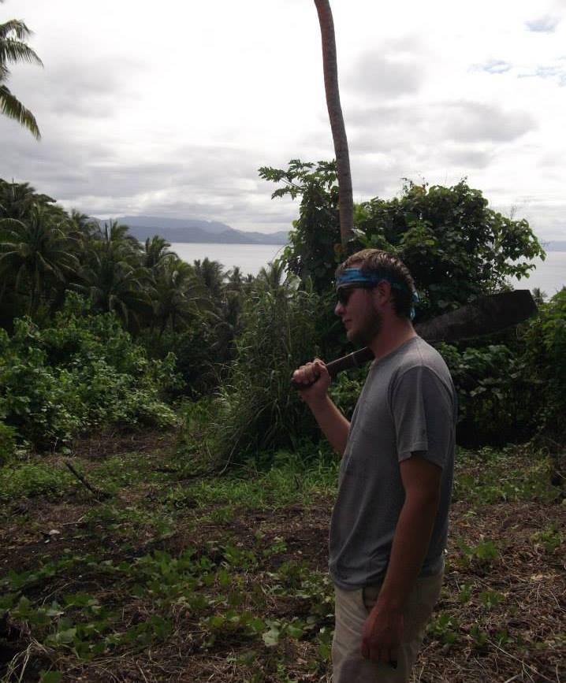

<link rel="stylesheet" href="styles.css" type="text/css">
<link rel="stylesheet" href="academicicons/css/academicons.min.css"/>

# About Me 
I grew up Alabama and earned my B.A. in Anthropology from [The University of Alabama at Birmingham](https://www.uab.edu/home/) and completed my Ph.D at [The University at Albany-SUNY](https://www.albany.edu). The focus of my dissertation is applying quantitative genetic methods to model micro- and macroevolution in secondary sexual characteristics in mandrills (*Mandrillus sphinx*) and other primates.

Aside from dissertation research, I like to take [photos](https://www.instagram.com/jerredkschafer/) sometimes.  

